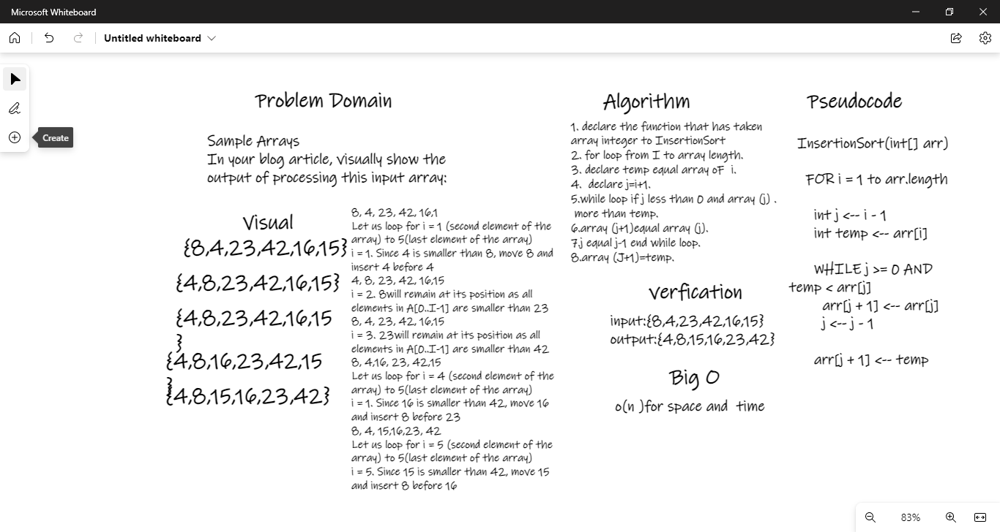

# BLOG
# Challenge Summary
Sample Arrays 
In your blog article, visually show the output of processing this input array:

## Whiteboard Process

## Approach & Efficiency
O(n^2)for time 
O(1) for space  
## Solution
result={4, 8, 15, 16, 23, 42}