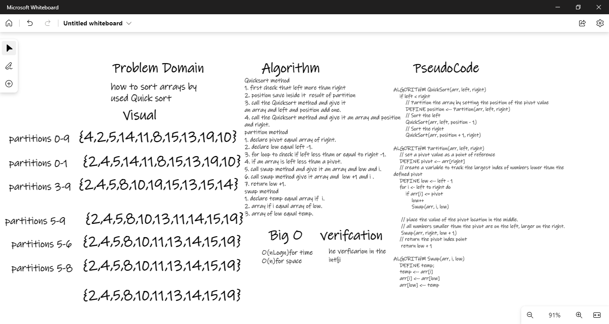

# QuickSortCodeChallange28
# Challenge Summary
Sample Arrays 
how to sort array using sort style 
## Whiteboard Process

## Approach & Efficiency
O(nLogn)for time 
O(n)for space  
## Solution
result={4, 8, 15, 16, 23, 42} 