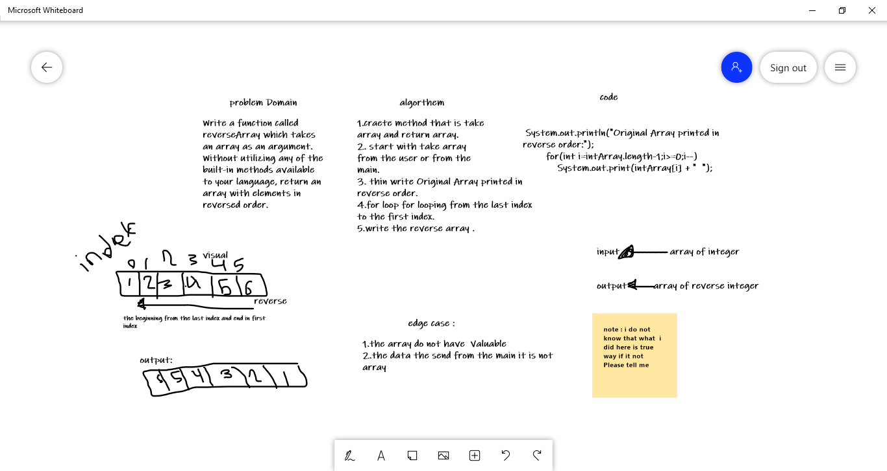

# Reverse an Array
Write a function called reverseArray which takes an array as anargument. Without utilizing any of the built-in methods available to your language, return an array with elements in reversed order. 

## Whiteboard Process

## Approach & Efficiency
for loop style ,because it is the simple way to get array reverse.  