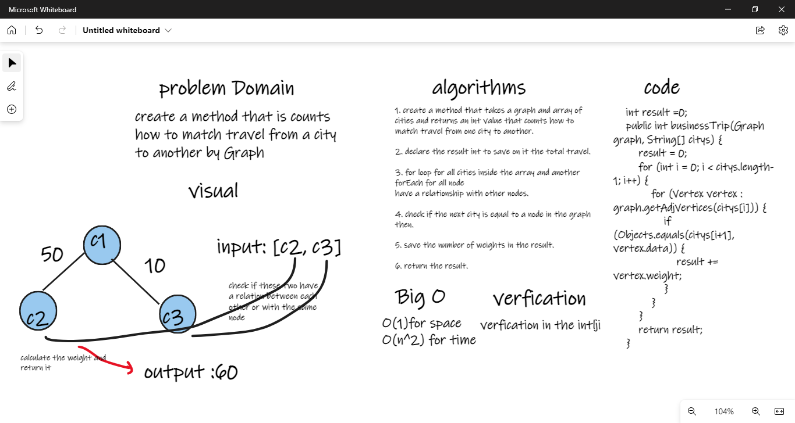

# Challenge Summary
create a method that is counts how to match travel from a city to another by Graph 

## Whiteboard Process

## Approach & Efficiency
O(1) for space 
O(n^2) for time 

## Solution
create node(vertex) for c1 and c2 and c3 
do the relation addEdge for c1 and c2 and c3  
create array of cities that have the relation node   
then call the method by the name of method  
example :     
graph.addVertex("c1"); 
graph.addVertex("c2"); 
graph.addVertex("C3"); 

graph.addEdge("c1","c2",10); 
graph.addEdge("c2","c3",30); 
String []city={c1,c3} 
graph.businessTrip(graph,city);  
