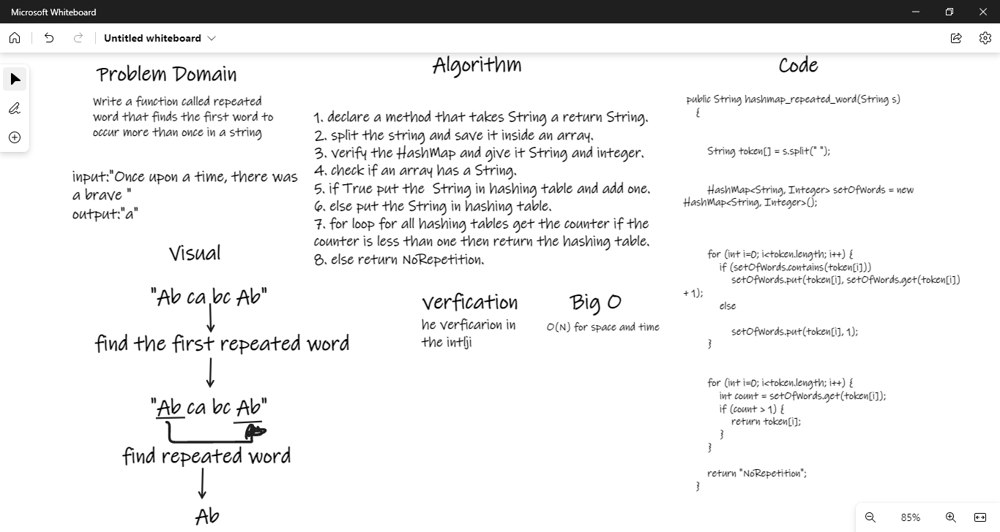

# Challenge Summary
Write a function called repeated word that finds the first word to occur more than once in a string 
Arguments: string 
Return: string 

## Whiteboard Process

## Approach & Efficiency
o(n) for space and time 
## Solution
input : "Ab ca bc Ab" 
then we will split it using space 
find the first repeated word  
"**_Ab_** ca bc **_Ab_**" 
first repeated word  
output : "Ab"  else if do not find return NoRepetition  
