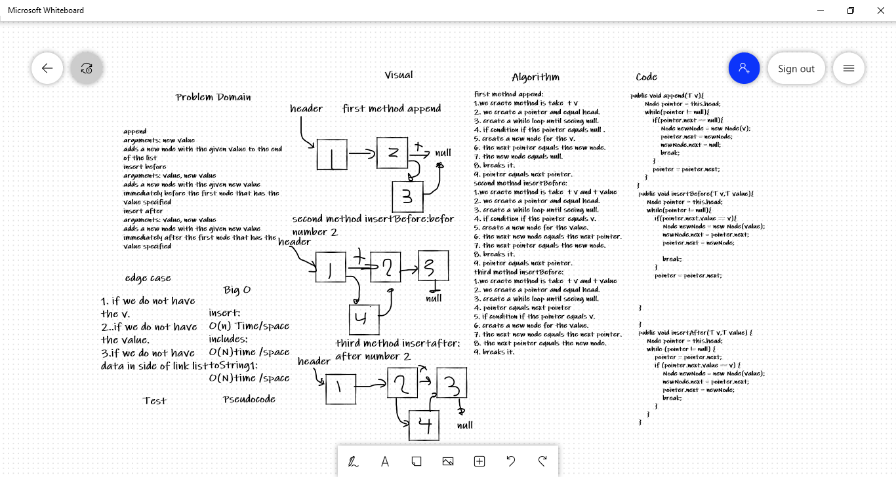

# Challenge Summary
append 
arguments: new value 
adds a new node with the given value to the end of the list 
insert before 
arguments: value, new value 
adds a new node with the given new value immediately before the first node that has the value specified 
insert after 
arguments: value, new value 
adds a new node with the given new value immediately after the first node that has the value specified 

## Whiteboard Process

## Approach & Efficiency
What approach did you take? Why? What is the Big O space/time for this approach?  
insert: 
O(n) Time/space 
includes: 
O(N)time /space 
toString1: 
O(N)time /space 

## Solution
<!-- Show how to run your code, and examples of it in action -->ist have it header and next value equal null.