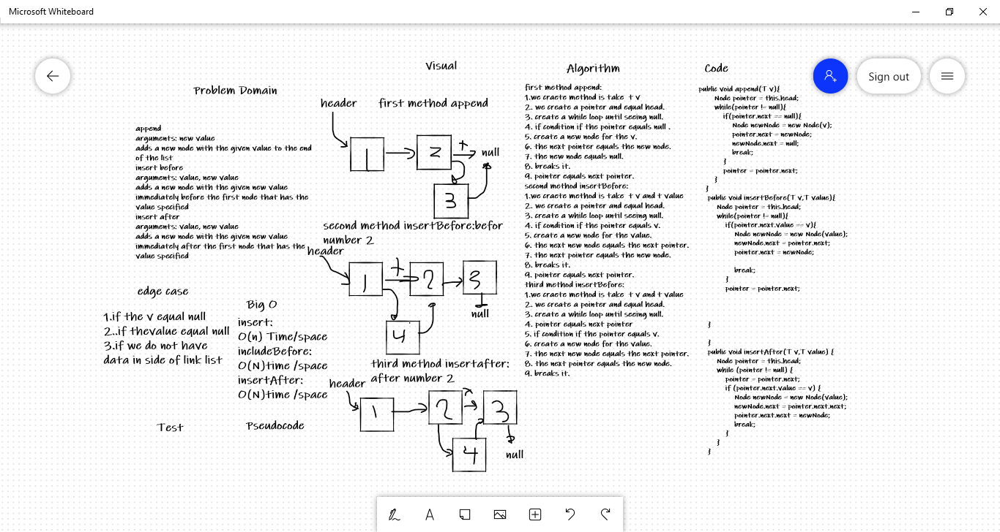

# Challenge Summary
Write a function called zip lists<br />
Arguments: 2 linked lists<br />
Return: New Linked List, zipped as noted below<br />
Zip the two linked lists together into one so that the nodes alternate between the two lists and return a reference to the the zipped list.<br />
Try and keep additional space down to O(1)<br />
You have access to the Node class and all the properties on the Linked List class as well as the methods created in previous challenges.<br />

## Whiteboard Process


## Approach & Efficiency
method name is zip_lists
O(N) space/time

## Solution
```
First List: 1 —> 3 —> 5 —> 7 —> null
Second List: 2 —> 4 —> 6 —> null
After Merge: 1 —> 2 —> 3 —> 4 —> 5 —> 6 —> 7 —> null
```