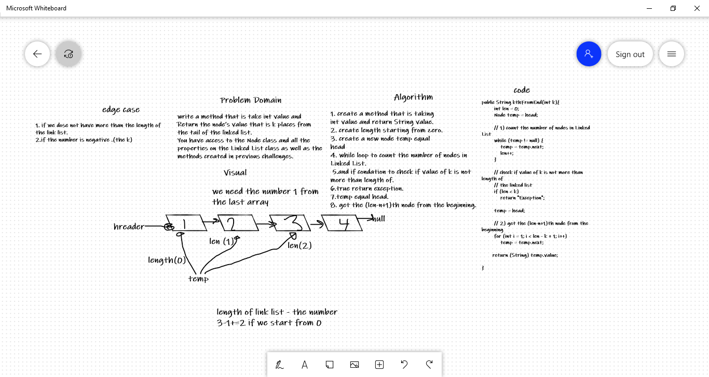

# Challenge Summary
<write a method that is take int value and Return the node’s value that is k places from the tail of the linked list. 
You have access to the Node class and all the properties on the Linked List class as well as the methods created in previous challenges. 

## Whiteboard Process

## Approach & Efficiency
kthFromEnd:
O(n) time/space

## Solution
I write the code like :
String a=newlist.kthFromEnd(1(the number of you return it to you ));
System.out.println(a);
the result is :
(this) in the scanner.