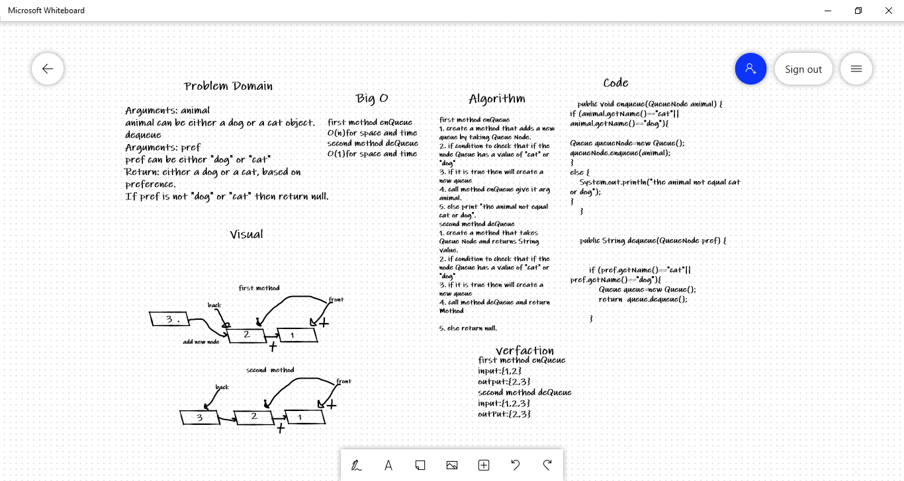

# Challenge Summary

Create a class called AnimalShelter which holds only dogs and cats. 
The shelter operates using a first-in, first-out approach. 
Implement the following methods: 
enqueue 
Arguments: animal 
animal can be either a dog or a cat object. 
dequeue 
Arguments: pref 
pref can be either "dog" or "cat" 
Return: either a dog or a cat, based on preference. 
If pref is not "dog" or "cat" then return null. 

## Whiteboard Process

## Approach & Efficiency
enQueue method
O(n)for Space and time
deQueue
O(1)for space and time

## Solution
enQueue
Output:
[5]->[10]->[15]->[20]
Input:
[10]->[15]->[20]
deQueue
Output:
[5]->[10]
Input:
[5]->[10]->[15]