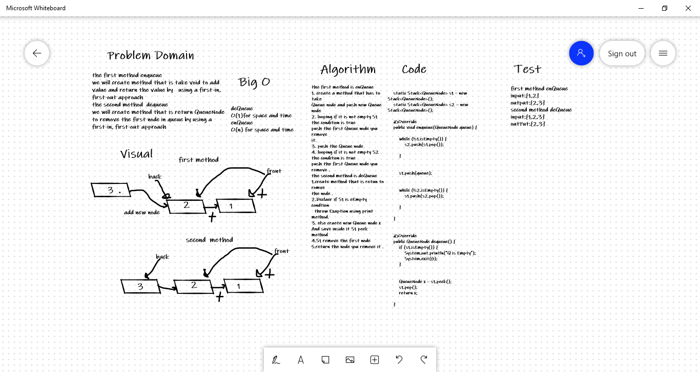

# Challenge Summary
Create a new class called pseudo queue. 
Do not use an existing Queue. 
Instead, this PseudoQueue class will implement our standard queue interface (the two methods listed below), 
Internally, utilize 2 Stack instances to create and manage the queue 
Methods: 
enqueue 
Arguments: value 
Inserts value into the PseudoQueue, using a first-in, first-out approach. 
dequeue 
Arguments: none 
Extracts a value from the PseudoQueue, using a first-in, first-out approach.h 

## Whiteboard Process

## Approach & Efficiency
enQueue method
O(n)for Space and time
deQueue
O(1)for space and time

## Solution
enQueue
Output:
[5]->[10]->[15]->[20]
Input:
[10]->[15]->[20]
deQueue
Output:
[5]->[10]
Input:
[5]->[10]->[15]