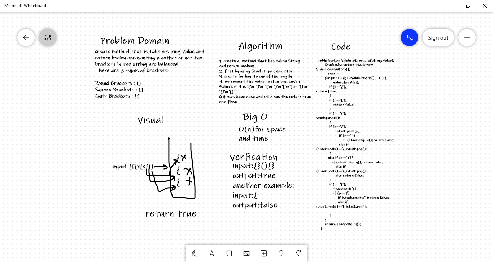

# Challenge Summary
Write a function called validate brackets 
Arguments: string 
Return: boolean 
representing whether or not the brackets in the string are balanced 
There are 3 types of brackets: 

Round Brackets : () 
Square Brackets : [] 
Curly Brackets : {} 

## Whiteboard Process

## Approach & Efficiency
Efficiency: 
O(N)for space and time 
## Solution
input:(]( 
output:false 
and another Solution 
input:{}(){} 
output:true 