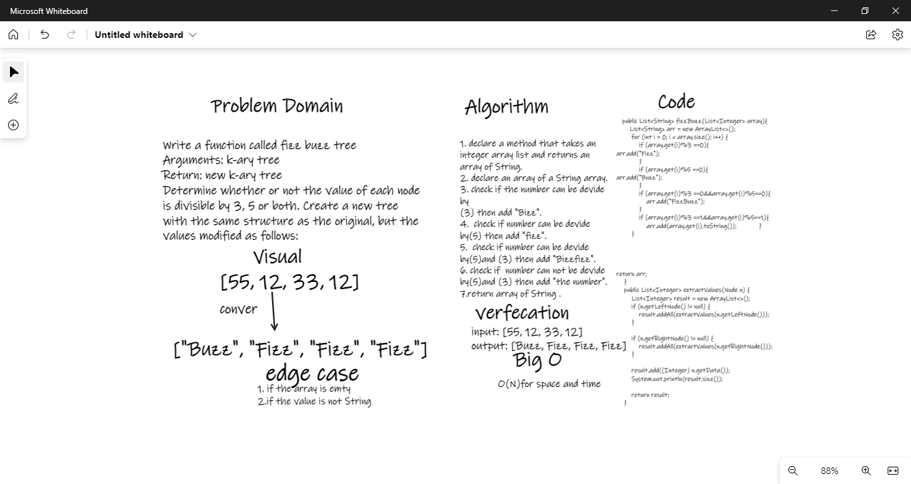

# Challenge Summary
Write a function called fizz buzz tree 
Arguments: k-ary tree 
Return: new k-ary tree 
Determine whether or not the value of each node is divisible by 3, 5 or both. Create a new tree with the same structure as the original, but the values modified as follows: 

If the value is divisible by 3, replace the value with “Fizz” 
If the value is divisible by 5, replace the value with “Buzz” 
If the value is divisible by 3 and 5, replace the value with “FizzBuzz” 
If the value is not divisible by 3 or 5, simply turn the number into a String. 
## Whiteboard Process

## Approach & Efficiency
fizz buzz method 
O(N) for space 
O(N) for time 

## Solution
input: [55, 12, 33, 12]    
output: [Buzz, Fizz, Fizz, Fizz]  
