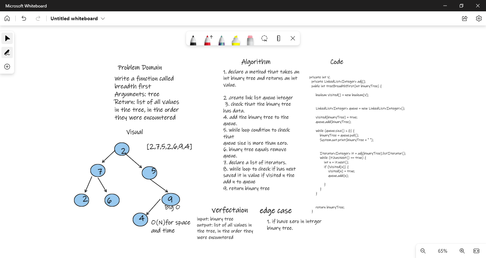

# Challenge Summary
Write a function called breadth first 
Arguments: tree 
Return: list of all values in the tree, in the order they were encountered
## Whiteboard Process

## Approach & Efficiency
Maxium value
O(n) for space
O(N) for time

## Solution
input: tree    
output:  list of all values in the tree, in the order they were encountered  
