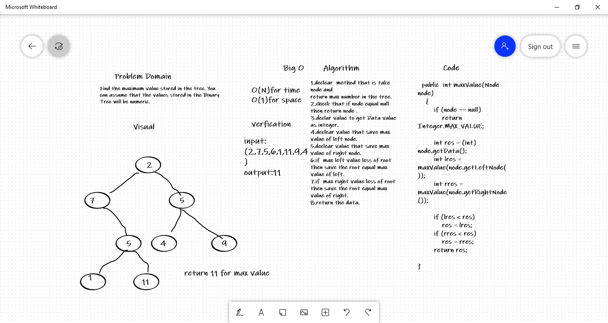

# Challenge Summary
Find the maximum value stored in the tree. You can assume that the values stored in the Binary Tree will be numeric. 

## Whiteboard Process

## Approach & Efficiency
Maxium value 
O(1) for space 
O(N) for time

## Solution
input: (2,7,5,6,1,11,9,4)    
output:  (11)   
